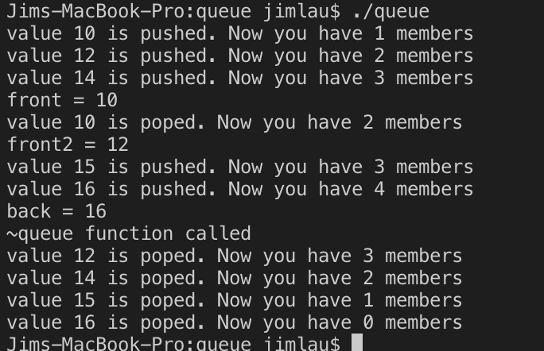

# C++ day12

## 1. 实现一个队列的类模板

模板声明：  

```cpp
// "include/queueHead.hh"
#ifndef __QUEUE_HEAD_H
#define __QUEUE_HEAD_H
#include <iostream>

template <class T>
class queue
{
    struct linkNode
    {
        T value;
        linkNode* next;
        linkNode():value(T()), next(nullptr){}
        linkNode(T x):value(x), next(nullptr){}
    };
    linkNode* _head, *_tail;
    int _size;
public:
    queue(){_tail = _head = new linkNode;_size = 0;}
    queue(const queue &x):_head(x._head), _tail(x._tail){}

    /* 元素入队  */
    void push(T);
    /* 元素出队 */
    void pop();
    /* 读取队头元素 */
    T front();
    /* 读取队尾元素 */
    T back();
    /* 判断队列是否为空 */
    bool empty();
    /* 判断队列是否已满 */
    bool full();

    ~queue();
};
#endif

#ifndef __QUEUE_METHOD_TCC
#define __QUEUE_METHOD_TCC
#include "./method.tcc"
#endif
```

模板实现：  

```cpp
#define __QUEUE_METHOD_TCC
#include "../include/queueHead.hh"

template <class T> void queue<T>::push(T x)
{
    linkNode* tmp = new linkNode(x);
    _tail->next = tmp;
    _tail = _tail->next;
    printf("value ");
    std::cout<<_tail->value;
    printf(" is pushed. Now you have %d members\n", ++_size);
}

template <class T> void queue<T>::pop()
{
    if(empty()) return;
    linkNode* tmp = _head -> next;

    printf("value ");
    std::cout<<tmp->value;
    printf(" is poped. Now you have %d members\n", --_size);
    _head -> next = _head -> next -> next;
    delete tmp;
}

template <class T> T queue<T>::front()
{
    T ret;
    if(empty())
    {
        printf("get value failed\n");
        return T();
    }
    ret = _head -> next -> value;
    return ret;
}

template <class T> T queue<T>::back()
{
    T ret;
    if(empty())
    {
        printf("get value failed\n");
        return T();
    }
    ret = _tail -> value;
    return ret;
}

template <class T> bool queue<T>::empty()
{
    return _size == 0;
}

template <class T> bool queue<T>::full()
{
    return false;
}

template <class T> queue<T>::~queue()
{
    printf("%s function called\n", __FUNCTION__);
    while(1)
    {
        if(empty())
        {
            delete _head;
            break;
        }
        pop();
    }
}
```

测试程序如下：  

```cpp
// "src/main.cc"
#include "../include/queueHead.hh"

int main()
{
    queue<std::string> sq2;
    std::string a;
    a = "10";sq2.push(a);
    a = "12";sq2.push(a);
    a = "14";sq2.push(a);
    std::string front = sq2.front();
    std::cout<<"front = "<<front<<std::endl;
    sq2.pop();
    front = sq2.front();
    std::cout<<"front2 = "<<front<<std::endl;
    a = "15";sq2.push(a);
    a = "16";sq2.push(a);
    std::string tail = sq2.back();
    std::cout<<"back = "<<tail<<std::endl;

    return 0;
}
```

测试结果：  


## 2. 实现一个模板形式的单例类，要求对于任意类型的类经过Singleton的处理之后，都能获取一个单例对象，并且可以传递任意参数

单例模式声明：

```cpp
// "include/singletonTemp.hh"
#ifndef __SINGLETON_TEMPLATE_HH
#define __SINGLETON_TEMPLATE_HH

#include <pthread.h>
#include <iostream>

template <class T>
class Singleton
{
public:
    template <typename ...Args> static T* getInstance(const Args&... args);

private:
    static void destroy();
    static void init();
    Singleton(): _value(T()){printf("%s\n", __FUNCTION__);}
    Singleton(const Singleton&){}
    ~Singleton(){printf("%s\n", __FUNCTION__);}

    T _value;
    static Singleton* _ptr;
    static pthread_once_t _auto;
};

#endif

#ifndef __SINGLETON_METHOD_CC
#define __SINGLETON_METHOD_CC
#include "singletonMethod.tcc"
#endif
```

单例模式实现：

```cpp
// "include/singletonMethod.tcc"
#define __SINGLETON_METHOD_CC

#include "singletonTemp.hh"

template <class T>
template <typename ...Args> T* Singleton<T>::getInstance(const Args&... args)
{
    printf("%s\n", __FUNCTION__);
    if(_ptr)
        return &_ptr->_value;
    ::atexit(Singleton::destroy);
    pthread_once(&_auto, init);
    _ptr->_value = T(args...);
    return &_ptr->_value;
}

template <class T>
void Singleton<T>::init()
{
    printf("%s\n", __FUNCTION__);
    _ptr = new Singleton;
}

template <class T>
void Singleton<T>::destroy()
{
    printf("%s\n", __FUNCTION__);
    if(_ptr)
        delete _ptr;
}

template <class T> Singleton<T>* Singleton<T>::_ptr = nullptr;
template <class T> pthread_once_t Singleton<T>::_auto = PTHREAD_ONCE_INIT;
```

测试程序：

```cpp
// "include/Computer.hh"
#include <string>
class Computer
{
public:
    Computer(std::string name, double price)
    : _Name(name)
    , _Price(price)
    {}
    Computer()
    : _Name()
    , _Price(-1)
    {}

private:
    std::string _Name;
    double _Price;
};

// "include/Point.hh"
class Point
{
public:
    Point(double x, double y)
    : _ix(x), _iy(y)
    {}
    Point()
    : _ix(0), _iy(0)
    {}

private:
    double _ix, _iy;
};

// "src/main.cc"
Point pt(1, 2);
Point pt2(3, 4);

Computer com("Mac", 8888);

int main(void)
{
Computer * p1 = Singleton<Computer>::getInstance("Xiaomi", 6666);
Computer * p2 = Singleton<Computer>::getInstance("Xiaomi", 6666);
printf("p1 address = %p, p2 address = %p\n", p1, p2);

Point　* p3 = Singleton<Point>::getInstance(1, 2);
Point　* p4 = Singleton<Point>::getInstance(1, 2);
printf("p3 address = %p, p4 address = %p\n", p3, p4);

return 0;
}
```

测试结果：  


## 3. 实现log4cpp的封装，使其可以像printf一样使用，测试用例如下

```cpp
void test() {
    int number = 100;
    const char * pstr = "hello, log4cpp";
    LogInfo("this is an info message. number = %d, str = %s\n", number, pstr);
}
```

LogInfo模板：

```cpp
template <typename ...T> static void LogInfo(const char *str, const T&...args)
{
    _restore->debug.info(str, args...);
}
```

```cpp
// "include/log4cpp_head.hh"
#ifndef _LOG4CPP_HEAD_HH
#define _LOG4CPP_HEAD_HH

#include <pthread.h>

#include <string>
#include <log4cpp/Category.hh>
#include <log4cpp/PropertyConfigurator.hh>
#include <log4cpp/OstreamAppender.hh>
#include <log4cpp/BasicLayout.hh>
#include <log4cpp/Priority.hh>
#include <log4cpp/PatternLayout.hh>
#include <log4cpp/StringQueueAppender.hh>
#include <log4cpp/RollingFileAppender.hh>

using namespace log4cpp;

#define log4cpp_prt(func, string) func("%s --%s--%s--%d--", x.c_str(), __FILE__, __FUNCTION__, __LINE__)
using std::cout;
using std::endl;

class Log
{
public:
    template <typename ...T> static void LogInfo(const char *str, const T&...args)
    {
        _restore->debug.info(str, args...);
    }
    static Log* genObj();
    static void destroy();

    log4cpp::Category& fatal;
    log4cpp::Category& warn;
    log4cpp::Category& debug;

private:
    static void init();
    Log();
    ~Log();
    log4cpp::Category& _root;
    static Log* _restore;
    static pthread_once_t _auto;
};

Log* Log::_restore = nullptr;
pthread_once_t Log::_auto = PTHREAD_ONCE_INIT;

Log::Log():
    fatal(log4cpp::Category::getInstance(std::string("fatal"))),
    warn(log4cpp::Category::getInstance(std::string("warn"))),
    debug(log4cpp::Category::getInstance(std::string("debug"))),
    _root(log4cpp::Category::getRoot())
    {}

Log::~Log(){}

Log* Log::genObj()
{
    if(_restore)
        return _restore;
    pthread_once(&_auto, init);
    return _restore;
}

void Log::init()
{
    try
    {
        PropertyConfigurator::configure("./config/log4cpp.conf");
    }
    catch(ConfigureFailure& f)
    {
        std::cerr << f.what() << '\n';
        exit(-1);
    }
    _restore = new Log;
    ::atexit(destroy);
}

void Log::destroy()
{
    if(_restore ==nullptr)
        return;
    Category::shutdown();
    delete _restore;
}
#endif
```

测试结果：  


## 4. STL是由哪些组件构成的？它们各自具备什么样的特点

1. 容器(`container`)  
容器可以将内部结构封装起来，包括内存分配、结构调整拼接等操作，对外只显示特定数据结构的功能组件或方法

2. 迭代器(`iterator`)  
迭代器只支持递增`++`、递减`--`，不支持`+`、`-`，重载了解引用符号`*`，类似于指针

3. 空间配置器(`allocator`)  

4. 配接器(`adapters`)  

5. 算法(`algorithm`)  

6. 仿函数(`functors`)  

## 5. 序列式容器都有哪些异同

`vector`类似于数组，具有的适配器有`stack`，属于连续的存储空间，长度可变，但是在达到长度上限的时候需要重新分配，复制，释放，可以随机访问位置，但删除、插入需要`O(n)`复杂度，`string`亦然。  
`list`类似于链表，不可以随机访问，但删除，插入只需要`O(1)`复杂度。  
`deque`是一种复杂的线性容器，具有的适配器有`queue`，它通过`allocator`实现了内存块的拼接，表现出连续的特点，但实际上块与块之间不连续，支持随机访问，但删除、插入需要`O(n)`复杂度。  
